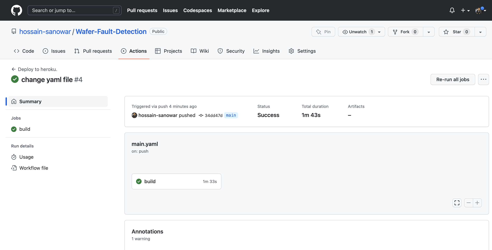

# CI-CD-GitHub-Actions
This repository is created a CI/CD pipeline using GitHub Actions for Heroku Cloud platform

1. Create yaml file through github for some scripting link: https://github.com/marketplace/actions/build-push-and-release-a-docker-container-to-heroku
```
mkdir .github
mkdir .github/workflows
touch .github/workflows/main.yaml
```

2. Create CI/CD Pipeline through `GitHub Actions`
```
open GitHub Project -> Settings -> Secrets -> Actions -> New repository secret
Name: HEROKU_EMAIL
Value: emailadress
Name: HEROKU_API_KEY
Value: Key_vale
Name: HEROKU_APP_NAME
Value: App_name
```
# Workflow: 
code -> GitHub -> GitHub Actions -> Heroku Cloud


